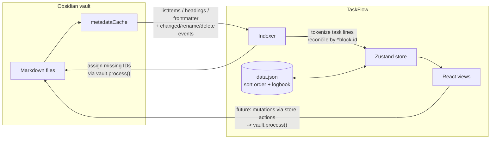

# TaskFlow

An Obsidian plugin that turns your vault into a full task and project manager. Tasks stay as plain markdown checkboxes in your notes; TaskFlow gives you Inbox / Today / Upcoming / Whenever / Someday / History views over them.

**Markdown is the source of truth.** The plugin's persisted index only owns manual sort order, completion history, and recurrence bookkeeping — deleting `data.json` loses nothing else.

## Quick install

No build tools needed — the plugin is three files in your vault:

1. Download `main.js`, `manifest.json`, and `styles.css` from the [latest release](https://github.com/jamesmcculley/taskflow/releases/latest) into `<your vault>/.obsidian/plugins/taskflow/` (create the folder). Or from a terminal:

   ```bash
   VAULT="/path/to/your/vault"
   mkdir -p "$VAULT/.obsidian/plugins/taskflow" && cd "$VAULT/.obsidian/plugins/taskflow"
   curl -LO https://github.com/jamesmcculley/taskflow/releases/latest/download/main.js
   curl -LO https://github.com/jamesmcculley/taskflow/releases/latest/download/manifest.json
   curl -LO https://github.com/jamesmcculley/taskflow/releases/latest/download/styles.css
   ```

2. Open the vault in Obsidian → **Settings → Community plugins** → turn off Restricted mode → enable **TaskFlow**. (Restart Obsidian first if it was already open.)
3. Run the command **TaskFlow: Open sidebar** (Cmd/Ctrl+P).

## Updating

The sidebar footer always shows the version currently running ("TaskFlow v0.10.0") — check it against the [latest release](https://github.com/jamesmcculley/taskflow/releases/latest) to see if you're behind.

1. Re-download the same three files (`main.js`, `manifest.json`, `styles.css`) from the latest release into `<your vault>/.obsidian/plugins/taskflow/`, overwriting the old ones. Reusing the terminal command from Quick install works as-is — `curl`'s `-O` flag overwrites by default:

   ```bash
   VAULT="/path/to/your/vault"
   cd "$VAULT/.obsidian/plugins/taskflow"
   curl -LO https://github.com/jamesmcculley/taskflow/releases/latest/download/main.js
   curl -LO https://github.com/jamesmcculley/taskflow/releases/latest/download/manifest.json
   curl -LO https://github.com/jamesmcculley/taskflow/releases/latest/download/styles.css
   ```

2. Reload the plugin — either click the **⟳** button next to the version number in the sidebar footer, or toggle TaskFlow off and on in **Settings → Community plugins**. A full Obsidian restart also works but isn't required.
3. Check the sidebar footer again to confirm the new version loaded.

Nothing about your tasks, projects, or settings depends on the plugin version — `data.json` and your markdown are untouched by an update.

## Conventions

Tasks are checkbox lines inside notes:

```markdown
- [ ] Set up staging server ⏳ 2026-07-21 📅 2026-07-28 #dev ^t-a1b2c3
- [x] Audit current site ✅ 2026-07-15
- [-] Migrate old blog posts
```

| Token | Meaning |
| --- | --- |
| `- [ ]` / `- [x]` / `- [-]` | todo / done / cancelled |
| `⏳ YYYY-MM-DD` | Scheduled — when you plan to start |
| `📅 YYYY-MM-DD` | Due (hard deadline) |
| `🔁 <rrule text>` | Recurrence, e.g. `🔁 every week` (parsed by the `rrule` package) |
| `#tag` | Tags |
| `✅ YYYY-MM-DD` | Completion stamp, written by the plugin |
| `🌙` | Tonight flag (Today's evening section) |
| `!!` / `!!!` | Medium / high priority — sorts above manual order (standalone token only) |
| `⏳ YYYY-MM-DD HH:mm` | Optional time on the scheduled date — Today sorts timed tasks chronologically |
| `#someday` | Task-level Someday — hides the task everywhere except the Someday view |
| `^t-xxxxxx` | Stable block-reference ID, assigned by the plugin on first index |

A checkbox indented under another checkbox is a **checklist item** of that task, not an independent task: it shows as an `n/m` progress chip and expands inline when the task is selected. Recurrence supports both fixed patterns (`🔁 every week` — stays aligned to the schedule) and after-completion patterns (`🔁 every week after done` — next occurrence counts from the day you complete it).

**Excluding checkboxes** that aren't tasks (packing lists, templates, meeting notes):

- One line: add `#notask` to the checkbox line — it's never indexed and never gets an ID.
- One note: add `taskflow: false` (or `ignore`) to the frontmatter.
- Whole folders: list them under **Settings → Excluded folders** (e.g. `Templates`).

Project membership: a task belongs to the note it lives in when that note has `type: project` frontmatter (`status: active | someday | done`). Tasks anywhere else — `Inbox.md`, daily notes, ordinary notes — are Inbox items. The markdown heading enclosing a task is its section heading.

## Views (the sidebar)

Six fixed lists, then Areas with their projects (progress pies included):

- **Inbox** — a triage holding area: open tasks outside any project note that have no scheduled or due date. It's not tied to a location — scheduling a task (giving it a date, which puts it in Today/Upcoming) or filing it into a project/Someday removes it from Inbox automatically; clearing that date or removing it from a project puts it right back, so nothing gets lost by editing. Completing or cancelling it removes it for good — it won't reappear on a later edit unless you mark it undone.
- **Today** — open tasks scheduled or due today or earlier; overdue items surface at the top, flagged.
- **Upcoming** — tasks dated after today, grouped by day: Tomorrow, weekday names this week, then `Jul 25`.
- **Whenever** — open tasks in active projects with no scheduled date.
- **Someday** — tasks in `status: someday` projects.
- **History** — completed/cancelled tasks from the index completion log, grouped by day, newest first. Right-click any completion for **Edit date…** if it was logged on the wrong day — it corrects the log entry, moves its daily-note journal line to the right day, and (if the task's markdown line still shows that ✅ stamp) corrects the stamp too. Completions are picked up no matter how they happened — clicking the checkbox in the sidebar, clicking Obsidian's own checkbox in the note, hand-typing `[x]`, or a change synced in from elsewhere: the indexer notices any done/cancelled task with no History entry yet, adds a `✅` stamp if it's missing one, and logs it using that stamp's date (or today's, if there wasn't one to read). A done date can be corrected either way, too: use **Edit date…**, or just edit the `✅` date directly on the line — the next reindex syncs the History entry (and moves its daily-note journal line) to match, since markdown is always the source of truth.
- **Projects** — under collapsible Area headers (`area: <name>` frontmatter) or standalone; each project view groups tasks by heading, with task-level Someday items dimmed at the bottom.
- **Areas are clickable** — an area header opens a view of all its projects' open tasks, grouped by project.
- **Quick search** — the search row at the top of the sidebar (or the `Quick search` command): fuzzy search across lists, filters, areas, projects, and open tasks; choosing a task jumps to its context and selects it.
- **Today** has a 🌙 **Tonight** section; flagging a task for tonight also schedules it today if it wasn't already.
- **Stats** — completion stat tiles (today / week / month / all time), streak tracking, and a scrollable 26-week heatmap built from the completion log. The heatmap ramp derives from your theme's accent color, so it works in any light or dark theme.
- **Review** — a guided weekly review (also the command `Start weekly review`): Inbox → overdue → every active project (ordered by area, then name) → Someday, one step at a time. Lists are live, so processing an item removes it from the step; empty groups are skipped; finishing records the review date, shown on the start screen.
- The sidebar footer shows the running plugin version with a **reload button** beside it (disable + re-enable, re-reading `main.js` from disk).
- Every task shows a **source chip** (`#Note Name`) naming the note it lives in — useful in Inbox, Upcoming, Whenever, and other views that mix tasks from many files. It's computed from the file path, not written to markdown, and it's hidden inside a project's own view where it would just repeat the page you're already on.

In the narrow right sidebar the nav collapses behind a menu button; opened as a workspace tab (drag the view to the main area) it becomes a two-pane sidebar + content layout.

## Recurrence

Completing a task with `🔁 <text>` rewrites the same line as a fresh todo with advanced date(s) and records the completion in the index log. The anchor is the scheduled date (else due, else today); the next occurrence is the first strictly after max(anchor, today), so overdue repeats skip forward but stay pattern-aligned. When both dates exist, due keeps its offset from scheduled. Supported phrases: anything `rrule` parses (`every day`, `every week`, `every 3 days`, `every weekday`, `every tuesday`, …) plus `every 3rd friday`-style shorthand, normalized to monthly.

## Quick capture

`TaskFlow: Quick capture` opens a one-line modal with a live parse preview:

```
Buy paint tomorrow #home !due friday >Home Renovation
```

- Free text becomes the title; the first natural-language date (via chrono) becomes the scheduled date — with a time (`tomorrow at 9:30`) when you give one.
- `!due <date>` sets a due date (natural language works too).
- `>Project Name` files the task into a matching project (exact → prefix → substring match); otherwise it goes to `Inbox.md`.
- `every …` phrases (`every monday`, `every 2 weeks after done`) become recurrence.
- `!!` / `!!!` set priority; `#tags` pass through.

## Commands

All hotkey-bindable: **Open sidebar**, **Quick capture**, and editor commands acting on the task under the cursor — complete/uncomplete, cancel, schedule today/tomorrow, schedule via date picker, set deadline via date picker, clear scheduled date, move to project. In the sidebar, click a checkbox to complete and right-click a task for schedule/move/cancel.

The **When…** / **Deadline…** pickers accept natural language (`friday`, `aug 3`, `in 2 weeks`, `yesterday` — past dates included) and offer Today / Tomorrow / Next week / Clear date quick options.

## Pinned filters

Saved smart lists, pinned to the sidebar with live counts. Click **New filter** in the sidebar: name + any combination of tags (all must match; nested tags match by prefix), project, area, date window (overdue / today / this week / no date / has date), and title text. Filters match open tasks, combine criteria with AND, and are editable/deletable via right-click.

## Daily-note sync

When enabled (default), completing a task appends a journal line to that day's daily note under a configurable heading (default `## Completed`):

```markdown
- ✅ 14:32 Send weekly email ([[Website Redesign]]) %%t-a1b2c3%%
```

Lines are plain list items (not checkboxes) so the indexer ignores them; the `%%id%%` comment is invisible in preview and lets uncompleting remove the exact line — even days later, from the right note. Folder and filename format come from the Daily Notes core plugin. The command **Sync today's completions to daily note** backfills on demand (deduplicated).

## Interactions

- **Click** selects a task; **double-click** (or Enter) opens its note at the line.
- **Keyboard**: ↑/↓ move the selection, Space completes/uncompletes, Enter opens, Cmd/Ctrl+1–6 switch between the six lists (click the panel first to focus it).
- **Completing** animates the checkbox and the task lingers briefly before leaving the list; recurring tasks roll forward in place.
- **Drag and drop** reorders tasks in Inbox, Today, Whenever, Someday, and within project heading sections; the order persists in the plugin index (never in your markdown).
- The floating **＋ button** captures into the current context: the open project, Today (pre-scheduled), or Inbox.
- Due tasks show a countdown badge ("3d left", "due today", "2d overdue") within two weeks of the deadline.
- **Click a date chip** on any task to reschedule (⏳) or change the deadline (📅) via the picker.
- **Overdue → Today**: the button on Today's Overdue header (or the `Roll all overdue tasks to today` command) reschedules everything that slipped in one shot.
- **Complete on date…** in the context menu backdates a completion — the ✅ stamp, History, stats, and the daily-note journal all land on the chosen day.
- **Board view**: in the wide two-pane layout, project views have a list/board toggle in the header — columns are the project's headings, and dragging a card between columns moves the task under that heading in the markdown.
- **Export History as CSV** writes `TaskFlow History.csv` to the vault root for spreadsheet analysis.

## Architecture

```
src/
  main.ts        Plugin entry: lifecycle, commands, view + hover-source registration
  settings.ts    Settings tab + persisted data shape (settings, sort order, completion log)
  types.ts       Task model shared by all layers
  indexer/       Markdown -> Task[]: tokenizer, vault scanner, block-ID assignment
  store/         Zustand store (task map) + pure derived selectors
  views/         React app hosted in an Obsidian ItemView (right sidebar)
```

### Data flow



- **Indexer** does a full-vault scan on load using `metadataCache.getFileCache()` (`listItems`, `headings`, `frontmatter`) and a line tokenizer for the inline metadata — no full-file regex parsing where the cache suffices. Incremental updates come from `metadataCache.on('changed')`, `vault.on('rename')`, `vault.on('delete')`, debounced 250 ms per file. Tasks are reconciled by block ID; missing IDs are appended (batched per file) through `vault.process()` so concurrent edits are never clobbered.
- **Store** holds the task map; views subscribe through pure selectors (`inboxTasks`, `todayTasks`, `tasksByProject`). All mutations flow through store actions.
- **Views** are a single registered `ItemView` hosting a React 18 app with an internal router. Clicking a task opens its source note at the line; hovering previews the note via the registered hover-link source.

Performance targets: full reindex of 2,000 tasks < 500 ms, incremental file update < 10 ms. Enable "Debug performance logging" in settings to see timings in the console.

## Development

```bash
npm install
npm run dev        # esbuild watch mode -> main.js
npm run build      # typecheck + production build
npm run test       # vitest unit tests
npm run lint       # eslint
```

Manual testing against a vault:

```bash
cp .env.example .env    # set TEST_VAULT_PATH (defaults to ./test-vault)
npm run seed            # copy test-vault/seed/ fixtures into the vault
npm run build           # builds AND copies the plugin into the vault
```

Every build (watch or production) copies `main.js` + `manifest.json` + `styles.css` into the vault's `.obsidian/plugins/taskflow/` as real files (`npm run link` does the same copy standalone). Then open the vault in Obsidian, enable **TaskFlow** in Community plugins, and run **TaskFlow: Open sidebar**. The `test-vault/` directory is gitignored except `test-vault/seed/`, so it can be used directly as a disposable vault.

**Reload during development** (no extra plugins): with `npm run dev` running, every source save rebuilds and copies into the vault; click the ⟳ button next to the version in the TaskFlow sidebar footer to reload the plugin — it disables and re-enables it, re-reading `main.js` from disk. The version number beside the button confirms what's loaded.

## Conventions for contributors

- TypeScript strict mode; `npm run typecheck && npm run lint && npm run test && npm run build` must pass before every commit.
- `main.js` is a build artifact and stays out of git.
- Tokenizer and selectors are pure modules with no `obsidian` imports so they unit-test without mocks.
- Non-obvious choices are logged in [DECISIONS.md](DECISIONS.md).
